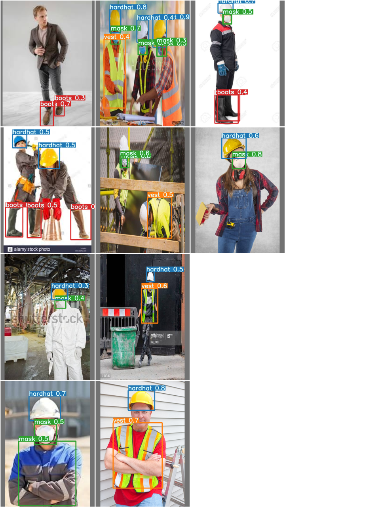

Results
=======

.. toctree::
    :hidden:

Here are some of the results generated by the model:

Depth images that were given by the model:

.. figure:: ../res/images/midas-output.png

|

And here are the object detection results given by the model:

|

And here are the plane detection results given by the model:

|

The results of plane detection are not that good, due to the fact that the model was trained on a few number of epochs (10).